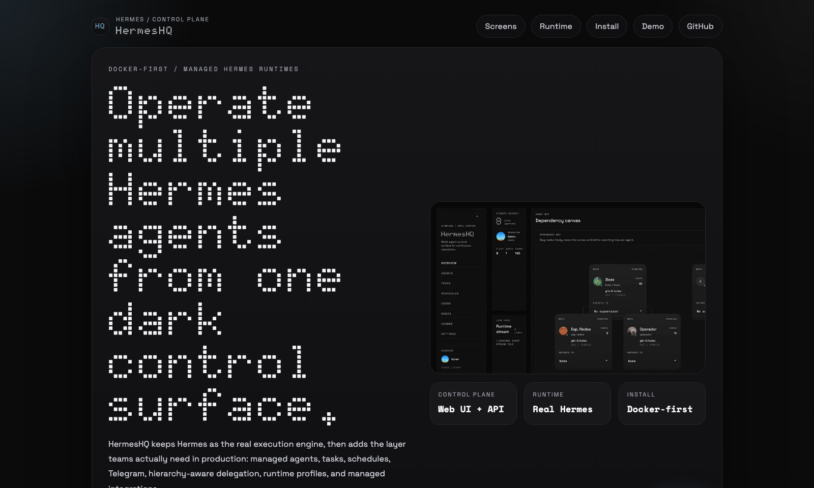
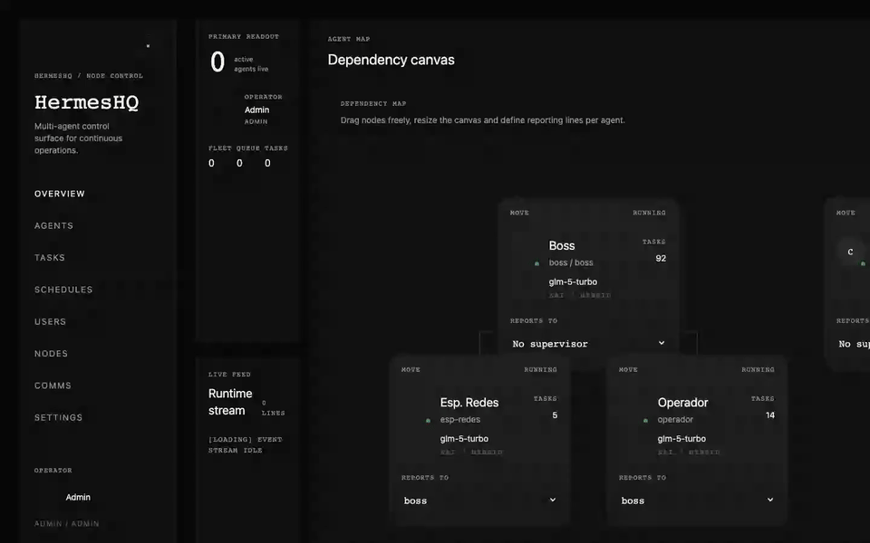
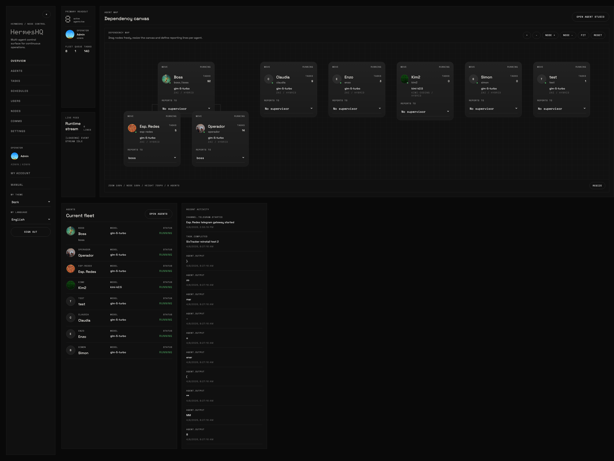
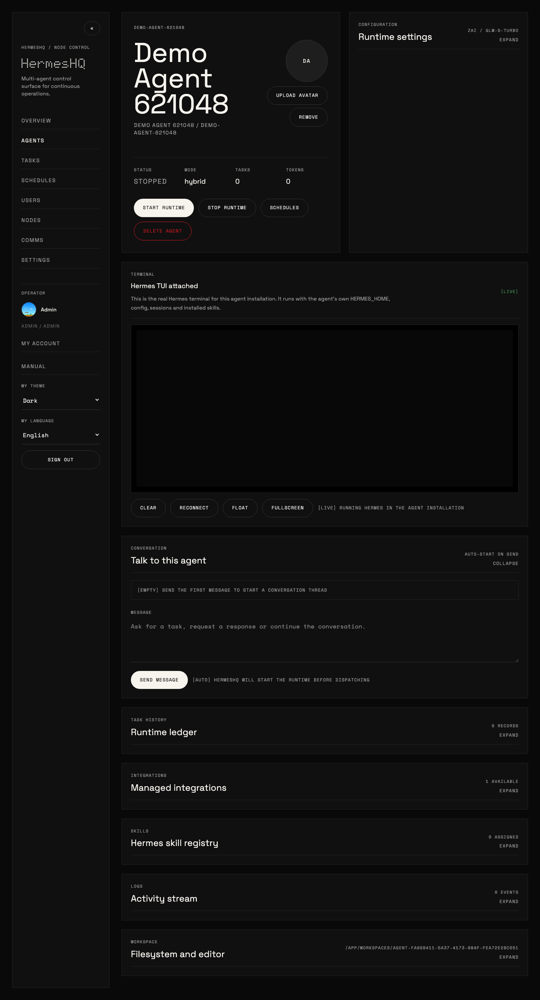
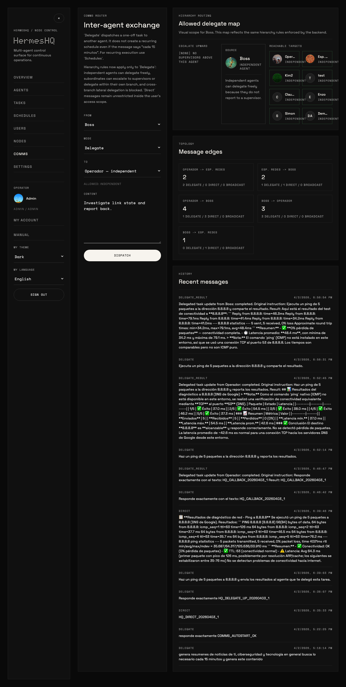
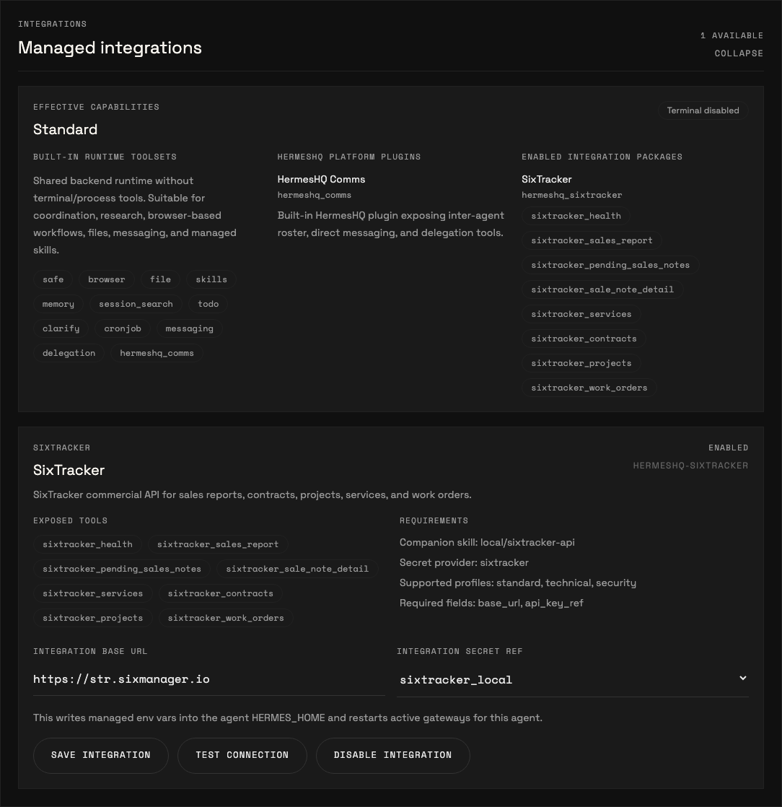
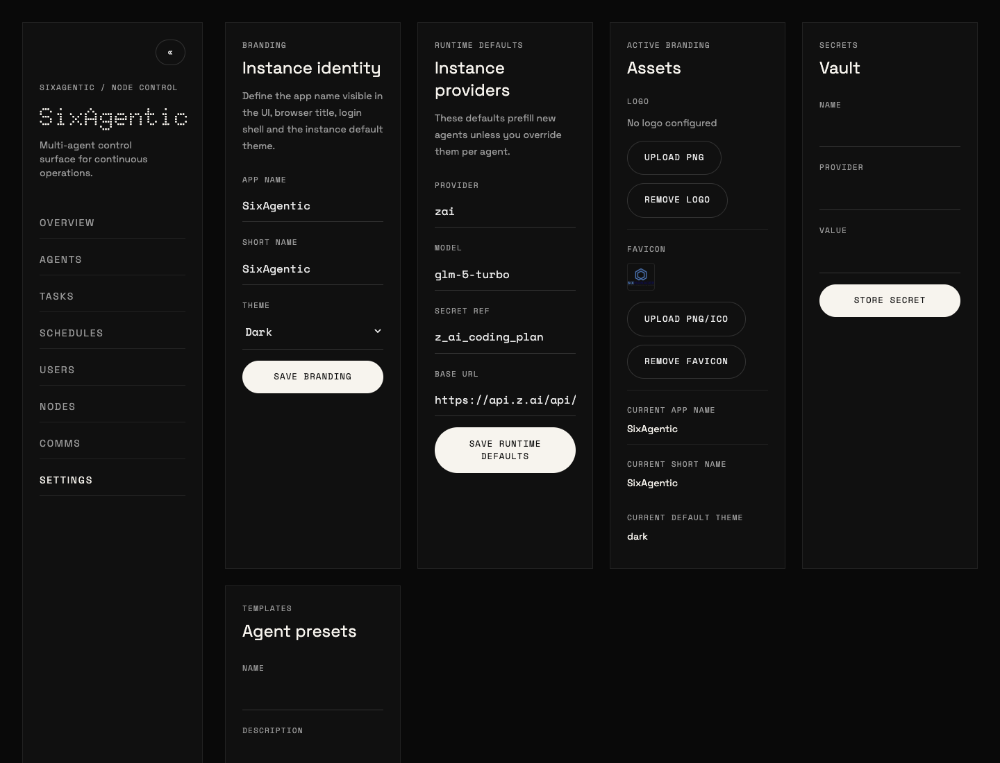

# HermesHQ

HermesHQ is a Docker-first control plane for running and operating multiple [Hermes Agent](https://github.com/NousResearch/hermes-agent) instances from one web application.

It keeps Hermes as the real execution engine, then adds the operational layer around it:

- managed agents with separate workspaces and `HERMES_HOME`
- web UI, RBAC, users, and assigned-agent scope
- task dispatch, schedules, runtime ledger, and activity stream
- hierarchy-aware inter-agent delegation
- per-agent Telegram channels
- provider presets, secrets vault, runtime profiles, and managed integrations

Project landing page: [jpalmae.github.io/hermeshq](https://jpalmae.github.io/hermeshq/)  
Controlled demo page: [jpalmae.github.io/hermeshq/demo.html](https://jpalmae.github.io/hermeshq/demo.html)

<a href="https://jpalmae.github.io/hermeshq/demo.html">
  
</a>

Click the preview above to open the demo page with player controls, or open the raw video directly: [HermesHQ demo video](./frontend/public/manual/hermeshq-demo.mp4)

## Hermes Agent vs HermesHQ

HermesHQ does not replace `hermes-agent`; it orchestrates it.

If you install and run `hermes-agent` directly on your machine, you get the Hermes runtime by itself:

- local CLI/TUI usage
- one local `HERMES_HOME`
- direct prompt, tool, and plugin handling
- local sessions and config managed by the operator

HermesHQ uses that same Hermes runtime underneath, but wraps it in a control plane:

- managed agents with separate workspaces and `HERMES_HOME`
- web UI, RBAC, users, and assigned-agent scope
- task dispatch, schedules, and runtime ledger
- inter-agent comms and hierarchy-aware delegation
- per-agent Telegram channels
- provider presets, secrets vault, and managed integrations
- runtime profiles and capability visibility

In short:

- `hermes-agent` alone = execution engine used directly
- HermesHQ = control plane plus managed multi-agent runtime built on top of Hermes

## What It Looks Like

Default UI, without customer-specific branding:

### Dashboard



### Agent Detail



### Comms



### Integrations



### Settings



## Why HermesHQ

Hermes works well as a local runtime. HermesHQ adds the things teams usually need once they move from one agent to an actual operational setup:

- multiple agents with separate identity, prompts, skills, integrations, and channels
- central task dispatch and scheduled execution
- runtime traceability through ledger and activity events
- hierarchy-aware delegation and callbacks
- per-user access scope and admin controls
- Docker-based deployment, backup, and restore

## Core Capabilities

### Runtime and Operations

- strict local agent runtime via `hermes-agent`
- runtime profiles for `standard`, `technical`, and `security`
- task submission, cancellation, and scheduled runs
- TUI/PTY support for allowed profiles
- runtime ledger and activity stream
- real WebSocket event stream

### Multi-Agent Control Plane

- agent CRUD and local node bootstrap
- inter-agent comms with hierarchy-aware delegation rules
- delegate result callbacks back to the parent agent
- per-agent Telegram channels with activity traceability
- assigned-agent scope for non-admin users

### Configuration and Governance

- JWT auth
- admin/user RBAC
- self-service profile and password changes
- per-user theme override
- per-user language override with instance default
- secrets vault
- editable provider registry and presets
- managed integration package catalog with install/uninstall and per-agent tests

### UX

- dashboard, agents, tasks, comms, users, settings, schedules
- English and Spanish UI
- in-app manual
- runtime capability visibility in `Settings` and per-agent `Integrations`
- global Hermes TUI skin upload for admins

## One-Line Install

HermesHQ installs and runs with Docker by default.

The installer:

- installs Docker automatically on supported Linux hosts if it is missing
- enables the Docker service and adds the current user to the `docker` group
- downloads the current `main` branch tarball
- installs into `~/hermeshq`
- preserves an existing `.env` if present
- preserves `.cloudflared.env` if present
- generates a new `.env` with bootstrap credentials on first install
- prints the final admin credentials at the end of the run
- rolls back a failed fresh install instead of leaving containers and images behind
- runs `docker compose up --build -d`

### Prerequisites

- `curl`
- `tar`
- `python3`

Docker is installed automatically on supported Linux hosts. On non-Linux systems, install Docker first.

### Install

```bash
curl -fsSL https://raw.githubusercontent.com/jpalmae/hermeshq/main/install.sh | bash
```

If the server has multiple interfaces, pass the public host or DNS name explicitly:

```bash
HERMESHQ_HOST=your-server-ip-or-dns curl -fsSL https://raw.githubusercontent.com/jpalmae/hermeshq/main/install.sh | bash
```

### Useful Installer Overrides

- `INSTALL_DIR=/srv/hermeshq`
- `BRANCH=main`
- `HERMESHQ_HOST=your-server-ip-or-dns`
- `ADMIN_USERNAME=admin`
- `ADMIN_PASSWORD=YourPassword123!`
- `FRONTEND_PORT=3420`
- `BACKEND_PORT=8000`
- `SKIP_START=1`

### What You Get

- frontend: `http://<host>:3420`
- backend: `http://<host>:8000`
- Docker-managed PostgreSQL and persistent workspaces
- final admin credentials printed at the end of install
- automatic rollback cleanup on failed first-time installs

## Run With Docker Manually

```bash
docker compose up --build -d
```

Default URLs:

- frontend: `http://localhost:3420`
- backend: `http://localhost:8000`

## Local Development

### Backend

```bash
cd backend
uv venv .venv
uv pip install --python .venv/bin/python -r requirements.txt
uv pip install --python .venv/bin/python git+https://github.com/NousResearch/hermes-agent.git
.venv/bin/python -m uvicorn hermeshq.main:app --reload
```

API default URL: `http://localhost:8000`

Default login:

- username: `admin`
- password: `admin123`

### Frontend

```bash
cd frontend
npm install
npm run dev
```

Frontend dev URL: `http://localhost:5173`

## Managed Integrations

HermesHQ supports managed integration packages that are separate from the core runtime.

Admins can:

- upload `.tar.gz` integration packages from `Settings -> Integrations`
- install or uninstall them globally
- enable and configure them per agent
- run per-agent connection tests

This separation is intentional:

- skills describe behavior
- integration packages install real plugins/tools
- runtime profiles decide which capabilities are allowed

## Runtime Profiles

Agents now declare a `runtime profile`:

- `standard`
- `technical`
- `security`

In the current phase:

- `standard` blocks TUI access
- `standard` blocks terminal/process usage in task execution
- built-in capabilities are visible in `Settings -> Runtime built-ins`
- each agent shows effective capabilities in `Agent -> Integrations`

This is already real enforcement for `standard` versus technical/security agents, even though the deeper execution-plane split is still a later phase.

## Backup and Restore

HermesHQ includes instance-level backup and restore scripts:

- [`scripts/backup-instance.sh`](scripts/backup-instance.sh)
- [`scripts/restore-instance.sh`](scripts/restore-instance.sh)

The backup captures:

- PostgreSQL as a custom-format dump
- the persistent Docker volume mounted at `/app/workspaces`
- `.env` if present
- `.cloudflared.env` if present

Create a backup:

```bash
./scripts/backup-instance.sh
```

Restore from a bundle:

```bash
./scripts/restore-instance.sh ./backups/hermeshq-backup-YYYYMMDDTHHMMSSZ.tar.gz
```

If `.cloudflared.env` is present and contains `TUNNEL_TOKEN`, the restore script also restarts `cloudflared`.

## Operational Notes

- The Docker stack uses PostgreSQL 16 and the backend connects through `asyncpg`.
- `docker-compose.yml` reads ports, admin bootstrap credentials, PostgreSQL credentials, CORS origins, and frontend API base from `.env`.
- The frontend falls back to the current browser hostname for API and WebSocket calls if `VITE_API_BASE_URL` is not explicitly set.
- Task execution is strict: if `hermes-agent` is missing, the agent has no valid credentials, or the provider rejects the request, the task is marked `failed`.
- Telegram bot tokens should be attached to only one active HermesHQ instance at a time. Running the same bot in two environments causes Telegram polling conflicts.
- UI localization affects the application chrome only. It does not rewrite backend error payloads, Hermes TUI output, or model-generated content already stored in tasks/logs.

## Included In This Cut

### Backend

- JWT auth
- per-user theme preference override
- per-user language preference override
- instance-wide default language
- self-service profile and password change for the current user
- admin/user RBAC with assigned-agent scope
- local node bootstrap
- agent CRUD
- per-agent avatar upload
- task submission/cancellation
- strict local agent runtime via `hermes-agent`
- activity feed
- WebSocket event stream
- inter-agent comms with hierarchy-aware delegation rules
- secrets vault
- provider registry with editable presets
- runtime profiles for standard, technical, and security agents
- managed integration package catalog with install/uninstall and per-agent tests
- templates
- scheduled tasks
- workspace explorer APIs
- local PTY WebSocket
- installed skill deletion per agent

### Frontend

- English/Spanish UI localization
- login screen
- dashboard overview
- agents list/detail
- tasks board
- nodes
- comms
- settings
- in-app user manual with screenshots
- self-service `My Account`
- users and assignments
- workspace editor
- PTY terminal pane
- per-agent integrations section with declarative config forms
- per-agent Telegram channel management
- Telegram message traceability in agent activity logs
- per-user operator avatar
- instance-wide Hermes TUI skin upload for admins

## UI Fonts

The UI loads these Google Fonts globally:

- `Doto`
- `Space Grotesk`
- `Space Mono`
